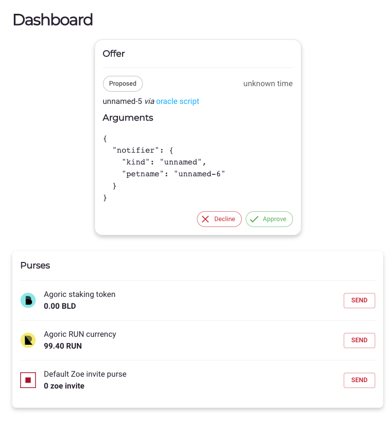

# Setup Guide

This is a step-by-step guide explaining how to set up a Chainlink node and an oracle on Agoric

## Requirements

Make sure you have the following requirements before starting:
1. node (Minimum version 14.15.0)
2. docker
3. docker-compose

## Step 1: Installing Agoric CLI (use agoricdev-13 branch)

``` bash
node --version # 14.15.0 or higher
npm install --global yarn
git clone https://github.com/Agoric/agoric-sdk
cd agoric-sdk
git checkout agoricdev-13
yarn install
yarn build
yarn link-cli ~/bin/agoric
cd packages/cosmic-swingset && make
echo "export PATH=$PATH:$HOME/bin" >> ~/.profile
source ~/.profile
agoric --version
```

## Step 2: Clone dapp-oracle and install dependencies

Before the setup, we have to run the following

```bash
git clone https://github.com/Agoric/dapp-oracle.git
cd dapp-oracle
git checkout main
agoric install
```

## Step 3: Change Network Config File

Change the IP in the file found in <b>dapp-oracle/chainlink-agoric/etc/network-config.json</b>.
<b>This has to be pointed to a node on Agoric Devnet</b>

```json
{
  "chainName": "agoricdev-13",
  "gci": "https://devnet.rpc.agoric.net:443/genesis",
  "rpcAddrs": [
    "https://devnet.rpc.agoric.net:443"
  ]
}
```

## Step 4: Run setup script

The next step involves running the script found at <b>dapp-oracle/chainlink-agoric/setup</b>.

```bash
#run this in the root directory of dapp-oracle
cd chainlink-agoric
docker-compose pull
./setup
#you will be prompted to create more oracles, click Y or N accoringly
```

This setup script does the following:
1. Starts docker containers via <b>chainlink-agoric/internal-scripts/common.sh</b> for:
    - Postgres DB Instance
    - Chainlink Node
    - Agoric local solo node
    - Chainlink Agoric External Adapter
    - Chainlink Agoric External Initiator
2. Adds the external initiator to the Chainlin knode via <b>chainlink-agoric/internal-scripts/add-ei.sh</b>
3. Adds the external adapter to the bridges section of the Chainlink node via <b>chainlink-agoric/internal-scripts/add-bridge.sh</b>

#### Troubleshooting 

If on running the script, you encounter such error:
```
Cannot find module '@agoric/zoe/exported'
```

Do the following:
1. Remove yarn.lock in /dapp-oracle
2. Run the following in /dapp-oracle
```bash
yarn install
```

## Step 5: Repeat this for all oracles

<b>Wherever there is \<N>< change it with oracle number (1,2,3) </b>

## Step 5A: Get AG Solo's address

Run the following

```bash
docker exec chainlink-agoric_ag-solo-node<N>_1 /bin/cat chainlink/ag-cosmos-helper-address
```

### Step 5B: Hit the faucet on Discord

1. Join Agoric's <a href="https://discord.com/invite/qDW8DRes4s">Discord Server</a>
2. in #faucet run the following command and replace <addr-step7> with the address obtained from step 7
  
```bash
!faucet client <addr-step7>
```
  
### Step 5C: Spawn the oracle
  
Run the following command
  
```bash
INSTALL_ORACLE="Chainlink oracle" agoric deploy api/spawn.js --hostport=127.0.0.1:689<N>
```

## Step 6: Send the addresses to the network administrators

This step involves the following:
1) Once all the node operators send in their addresses, network administrators create a governance proposal
2) Once it passes, the network administrators send a job spec in JSON format to each node operator

## Step 7: Get details from network administrators

The network administartors will provide the following:

1. TOML job spec file
2. List of bridges to add
3. Command to run
  
## Step 8: Repeat this for all oracles
  
<b>Wherever there is \<N> change it with oracle number (1,2,3) </b>
  
### Step 8A: Add the required bridges given in Step 7

### Step 8B: Create the Job

### Step 8C: Store the external job id of the new job
  
You have to do the following:
1. Copy the external id of the job you just created
  2. Edit the file in <b>dapp-oracle/api/flux-params.js</b> to the following
  
```js
// These parameters will be different based on what the price aggregator
// expects.  You may have to edit them!

// What minimum percentage of the price difference should result in a notification?
export const THRESHOLD = 0.1;

// What minimum absolute change in price should result in a notification?
export const ABSOLUTE_THRESHOLD = 0;

// How many decimal places does the price need to be shifted by?
export const PRICE_DECIMALS = 6;

// This is the query submitted to the oracle.
export const PRICE_QUERY = {
  jobId: '<external-job-id>',
};

// If no new round is started in this number of seconds, the oracle will initiate a new round.
export const IDLE_TIMER_PERIOD_S = 10n * 60n;

// This is the number of seconds between each poll.
export const POLL_TIMER_PERIOD_S = 60n;

// This is sent to the oracle node as the fee amount for the flux monitor
// query.  It isn't actually a real payment, just something to tell the oracle
// job that it has permission to run.
export const FEE_PAYMENT_VALUE = 0n;
```

### Step 8D: Run the given command

Run the given command from Step 11 in the root directory of dapp-oracle

<b>Example: </b>

```bash
AGGREGATOR_INSTANCE_LOOKUP='["agoricNames","instance","ATOM-USD priceAggregator"]' \
IN_BRAND_LOOKUP='["agoricNames","oracleBrand","ATOM"]' \
OUT_BRAND_LOOKUP='["agoricNames","oracleBrand","USD"]' \
FEE_ISSUER_LOOKUP='["wallet","issuer","RUN"]' \
agoric deploy api/flux-notifier.js --hostport=127.0.0.1:689<N>
```
  
### Step 8E: Accept the invitation

  1. Go to http://localhost:689N
  2. Click approve on the popup as per the image below
  
  </b>
