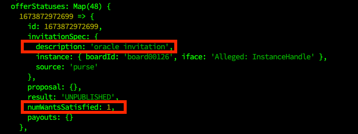

# Setup Guide

This is a step-by-step guide explaining how to set up a Chainlink node and an oracle on Agoric

## Requirements

Make sure you have the following requirements before starting:
1. node (Use version 16.17.0)
2. docker
3. docker-compose
4. jq

## Step 1: Installing Agoric CLI

``` bash
cd ~
node --version # 16.17.0 or higher
sudo npm install --global yarn
git clone https://github.com/agoric/agoric-sdk
cd agoric-sdk
git checkout 92b6cd72484079b0349d8ccfa4510aeb820e8d67
yarn install
yarn build
yarn link-cli ~/bin/agoric
cd packages/cosmic-swingset && make
echo "export PATH=$PATH:$HOME/bin" >> ~/.profile
source ~/.profile
agoric --version
agd version
```

## Step 2: Clone dapp-oracle and install dependencies

Before the setup, we have to run the following

```bash
cd ~
git clone https://github.com/SimplyStaking/dapp-oracle
cd dapp-oracle
git checkout emerynet
```

## Step 3: Clone the middleware's repository

Clone the repository containing the code for the middleware

```bash
cd ~
git clone https://github.com/SimplyStaking/agoric-cl-middleware.git
cd agoric-cl-middleware
git checkout origin/agoricdev-23
yarn install
```

## Step 4: Create a key and send the address to the chain management team

1. Create an agoric key

REPLACE WALLET_NAME WITH YOUR PREFERRED NAME

```bash
WALLET_NAME=test
agd keys add $WALLET_NAME --keyring-backend=test
```

2. Get the address

```bash
WALLET_ADDR=$(agd keys show "$WALLET_NAME" --keyring-backend test --output json | jq -r .address)
echo "Address: $WALLET_ADDR"
```

3. Send the address to the oracle team

## Step 5: Start a node


1. Create a service file

```bash
sudo tee /etc/systemd/system/agoric-node.service > /dev/null <<EOF  
[Unit]
Description     = agoric node service
Wants           = network-online.target beacon-chain.service
After           = network-online.target 

[Service]
User            = $USER
Environment="DEBUG=SwingSet:ls,SwingSet:vat"
ExecStart       = /home/agoric/go/bin/agd start --log_level=info --home /home/$USER/.agoric --log_level=warn
Restart         = always

[Install]
WantedBy= multi-user.target
EOF
```

2. Start node

```bash
systemctl daemon-reload
systemctl start agoric-node
```

3. Check if the node is still catching up

```bash
echo $(agd status) | jq ".SyncInfo.catching_up"
```

<b>Make sure the above is FALSE before going to the next step</b>

## Step 6: Provision the smart wallet

Once the node is synced, you need to provision the smart wallet

1. Provision the smart wallet

* Go to the <a href="https://devnet.faucet.agoric.net/">faucet</a>
* Enter the address and select "send IST and provision smart wallet"

2. Confirm the smart wallet provision

```bash
agoric wallet show --from "$WALLET_ADDR"
```
## Step 7: Wait a minute or two to ensure that the provisioning is finished

## Step 8: Accepting the oracle invitation

The next step involves accepting the oracle invitation

REPLACE WALLET_NAME WITH THE CHOSEN NAME IN STEP 4.1

```bash
WALLET_NAME=test
ASSET_IN=ATOM
ASSET_OUT=USD
CHAIN_ID=agoricdev-21
AGORIC_RPC=http://127.0.0.1:26657
cd ~/agoric-cl-middleware/scripts
./accept-oracle-invitation.sh $WALLET_NAME $ASSET_IN $ASSET_OUT $CHAIN_ID $AGORIC_RPC
```

## Step 9: Confirm acceptance

This step involves confirming that the oracle invitation was accepted in the previous step.

In order to do this, change $WALLET_NAME to the your wallet name and run the following command

```bash
agoric wallet show --from $(agd keys show $WALLET_NAME --keyring-backend test --output json | jq -r .address)
```

Then, under <b>offerStatuses</b>, make sure you have an accepted oracle invitation as can be seen in the image below. <b>numWantsSatisfied: 1</b> indicates that the oracle invitation was accepted successfully.



## Step 10: Prepare configs for middleware and monitoring tool

REPLACE ORACLE_NAME WITH YOUR PREFERRED NAME

```bash
cd ~/agoric-cl-middleware
THIS_VM_IP=$(hostname -I | sed 's/ *$//g')
THIS_VM_IP=$(echo ${THIS_VM_IP%% *})
WALLET_ADDR=$(agd keys show "$WALLET_NAME" --keyring-backend test --output json | jq -r .address)
echo "THIS_VM_IP=$THIS_VM_IP" > .env
echo "WALLET_ADDR=$WALLET_ADDR" >> .env

#create config
mkdir -p ~/config
ORACLE_NAME="ORACLE1"
echo "{ \"$WALLET_ADDR\" : { \"oracleName\": \"$ORACLE_NAME\" }}" > ~/config/oracles.json
```

## Step 11: Run setup script

The next step involves running the script found at <b>dapp-oracle/chainlink-agoric/setup</b>.
Replace <b>EMAIL</b> with your email to be used as the node's username

```bash
EMAIL=<your_email>
cd ~/dapp-oracle/chainlink-agoric
docker-compose pull
./setup $EMAIL
```

Once this is done, take a copy of the generated password from the output.

This setup script does the following:
1. Starts docker containers via <b>chainlink-agoric/internal-scripts/common.sh</b> for:
    - Postgres DB Instance
    - Chainlink Node
2. Adds the external initiator built inside the middleware to the Chainlink node via <b>chainlink-agoric/internal-scripts/add-ei.sh</b>
3. Adds the external adapter built inside the middleware to the bridges section of the Chainlink node via <b>chainlink-agoric/internal-scripts/add-bridge.sh</b>

## Step 12: Starting the middleware

To start the middleware, run the following commands

```
cd ~/agoric-cl-middleware

#build the images
docker-compose build middleware
docker-compose build monitor

docker-compose up -d
```


## Step 13: Adding Job to CL node


1. Go to http://IP:6691
2. Log in with the following credentials. The password can also be obtained from ~/dapp-oracle/chainlink-agoric/secrets/apicredentials
```
<your-email>
<password-from-step11>
```
3. Add the required bridges and job spec given out by the Simply Staking team

## Step 14: Query updated price

Run the following

```bash
agoric follow :published.priceFeed.ATOM-USD_price_feed
```
