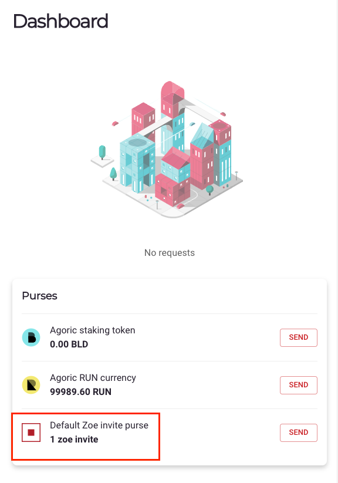
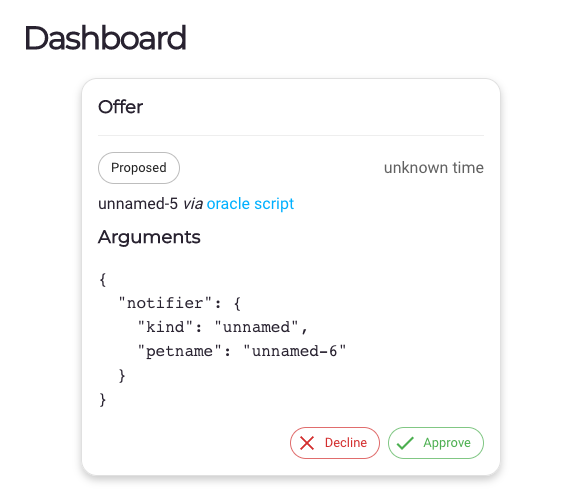

# Setup Guide

This is a step-by-step guide explaining how to set up a Chainlink node and an oracle on Agoric

## WHEN CLONING DAPP-ORACLE - USE BRANCH main

## Requirements

Make sure you have the following requirements before starting:
1. node (Minimum version 14.15.0)
2. docker
3. docker-compose

## Step 1: Installing Agoric CLI (use master branch)

``` bash
node --version # 14.15.0 or higher
npm install --global yarn
git clone https://github.com/Agoric/agoric-sdk
cd agoric-sdk
git checkout master
yarn install
yarn build
yarn link-cli ~/bin/agoric
cd packages/cosmic-swingset && make
echo "export PATH=$PATH:$HOME/bin" >> ~/.profile
source ~/.profile
agoric --version
```

## Step 2: Change Network Config File

Change the IP in the file found in <b>chainlink-agoric/etc/network-config.json</b>

```json
{
  "chainName": "agoric",
  "gci": "http://<ip>:26657/genesis",
  "rpcAddrs": [
    "<ip>:26657"
  ]
}
```

## Step 3: Start a local chain

Before the setup, we have to start a local chain.

```bash
#run this in the root directory of this project
agoric install
agoric start local-chain &> chain.log &
```

## Step 4: Run setup script

The next step involves running the script found at <b>chainlink-agoric/setup</b>.

```bash
#run this in the root directory of this project
cd chainlink-agoric
#this might not be necessary, skip if it errors
docker-compose pull
#IMP: Change ag-solo port definitions to 0.0.0.0 in dapp-oracle/chainlink-agoric/docker-compose.yml file
#When it asks for more to start other oracles, choose Y (yes)
./setup
```

This setup script does the following:
1. Starts docker containers via <b>chainlink-agoric/internal-scripts/common.sh</b> for:
    - Postgres DB Instance
    - Chainlink Node
    - Agoric local solo node to interact with the chain started in Step 3
    - Chainlink Agoric External Adapter
    - Chainlink Agoric External Initiator
2. Creates an Oracle with a dApp via <b>chainlink-agoric/internal-scripts/add-dapp-oracle.sh</b> which does the following:
    - Transfers coins to the ag-solo node
    - Installs the dapp-oracle contract
    - Adds the dapp-oracle to the Agoric node
3. Adds the external initiator to the Chainlink node via <b>chainlink-agoric/internal-scripts/add-ei.sh</b>
4. Adds the external adapter to the bridges section of the Chainlink node via <b>chainlink-agoric/internal-scripts/add-bridge.sh</b>
5. Adds a jobspec to the Chainlink node via <b>chainlink-agoric/internal-scripts/add-jobspec.sh</b>

#### Troubleshooting 

If on running the script, you encounter such error:
```
Cannot find module '@agoric/zoe/exported'
```

Do the following:
1. Remove yarn.lock in /dapp-oracle
2. Run the following in /dapp-oracle
```bash
yarn install
```

## Step 5: Log in the Chainlink node

1. Head to either:
    - <b>http://localhost:6691</b> (If from the same VM)
    - <b>http://<vm_ip>:6691</b> (If remotely)
2. Login with
```
Email: notreal@fakeemail.ch
Password: twochains
```

  
## Step 6: Spin up an additional privileged local-solo node

This will give priceAuthorityAdmin permissions to the node

Run the following command in the root directory of the project.

```bash
agoric start --reset local-solo 7999 agoric.priceAuthorityAdmin >& 7999.log &
```
  
## Step 7: Create a price authority based on an aggregator

Run the following command in the root directory of the project.

```bash
IN_BRAND_LOOKUP='["wallet","brand","BLD"]' \
OUT_BRAND_LOOKUP='["agoricNames","oracleBrand","USD"]' \
agoric deploy api/aggregate.js --hostport=127.0.0.1:7999
```

### Step 8: We have to repeat this for all oracles 

#### Step 8A: Create Bridges in the respective chainlink node

1. Change <b>\<N></b> and log into http://localhost:669\<N> with credentials from Step 5
2. Create the following new bridges from the <b>Bridges</b> tab
- bridge-nomics 
- bridge-tiingo
- bridge-coinmetrics

#### Step 8B: Create Job in the respective chainlink node

1. Change <b>\<N></b> and log into http://localhost:669\<N> with credentials from Step 5
2. Create the following new job 
```toml
name            = "ATOM-USD"
type            = "webhook"
schemaVersion   = 1
maxTaskDuration = "30s"
externalInitiators = [
  { name = "test-ei", spec = "{\"endpoint\":\"agoric-node\"}" },
]
observationSource   = """
    payment [type="jsonparse" data="$(jobRun.requestBody)" path="payment"]
    request_id [type="jsonparse" data="$(jobRun.requestBody)" path="request_id"]

   // data source 1
   ds1          [type=bridge name="bridge-nomics" requestData="{\\"data\\": {\\"from\\":\\"ATOM\\",\\"to\\":\\"USD\\"}}"];
   ds1_parse    [type=jsonparse path="result"];
   ds1_multiply [type=multiply times=1000000];
   ds1 -> ds1_parse -> ds1_multiply -> answer;

   // data source 2
   ds2          [type=bridge name="bridge-coinmetrics" requestData="{\\"data\\": {\\"endpoint\\":\\"crypto\\",\\"from\\":\\"ATOM\\",\\"to\\":\\"USD\\"}}"];
   ds2_parse    [type=jsonparse path="result"];
   ds2_multiply [type=multiply times=1000000];
   ds2 -> ds2_parse -> ds2_multiply -> answer;

   // data source 3
   ds3          [type=bridge name="bridge-tiingo" requestData="{\\"data\\": {\\"from\\":\\"ATOM\\",\\"to\\":\\"USD\\"}}"];
   ds3_parse    [type=jsonparse path="result"];
   ds3_multiply [type=multiply times=1000000];
   ds3 -> ds3_parse -> ds3_multiply -> answer;

    answer [type=median                      index=0]
    send_to_bridge [type="bridge" name="agoric" requestData="{ \\"data\\": {\\"result\\": $(answer), \\"request_id\\": $(request_id), \\"payment\\":$(payment) }}"]
    answer -> payment-> request_id -> send_to_bridge
"""
```
3. Take note of the external job ID

#### Step 8C: Change job ID in api/flux-notifier.js

You have to edit the <b>api/flux-notifier.js</b> file as follows and change \<jobID from step 8B>

```js
const PRICE_QUERY = {
  jobId: '<jobID from step 8B>'
};
```

The resulting <b>api/flux-notifier.js</b> file should be as follows

```js
// These parameters will be different based on what the price aggregator
// expects.  You may have to edit them!

// What minimum percentage of the price difference should result in a notification?
export const THRESHOLD = 0.1;

// What minimum absolute change in price should result in a notification?
export const ABSOLUTE_THRESHOLD = 0;

// How many decimal places does the price need to be shifted by?
export const PRICE_DECIMALS = 6;

// This is the query submitted to the oracle.
const PRICE_QUERY = {
  jobId: '<jobID from step 8B>'
};

// If no new round is started in this number of seconds, the oracle will initiate a new round.
export const IDLE_TIMER_PERIOD_S = 10n * 60n;

// This is the number of seconds between each poll.
export const POLL_TIMER_PERIOD_S = 60n;

// This is sent to the oracle node as the fee amount for the flux monitor
// query.  It isn't actually a real payment, just something to tell the oracle
// job that it has permission to run.
export const FEE_PAYMENT_VALUE = 0n;
```

### Step 8D: Get the node address

Change \<N> to the oracle number and run the following command

```bash
agoric deploy api/show-my-address.js --hostport=127.0.0.1:689<N>
```

### Step 8E: Send an invite to the oracle

Change \<address-step-8D> to the address obtained in step 8D and run the following command

```bash
ORACLE_ADDRESS=<address-step-8D> \
agoric deploy api/invite-oracle.js --hostport=127.0.0.1:7999
```

### Step 8F: Wait for the invitation

1. Change \<N> to the oracle number and head to http://\<VM-IP>:689\<N>

2. You should be able to see the following

</img>

### Step 8G: Initiate the flux notifier

Change \<N> to the oracle number and run the following command

```bash
AGGREGATOR_INSTANCE_LOOKUP=<from step 7> \
IN_BRAND_LOOKUP='["wallet","brand","BLD"]' \
OUT_BRAND_LOOKUP='["agoricNames","oracleBrand","USD"]' \
FEE_ISSUER_LOOKUP='["wallet","issuer","RUN"]' \
agoric deploy api/flux-notifier.js --hostport=http://127.0.0.1:689<N>
```

### Step 8H: Approve the invite

1. Change \<N> to the oracle number and head to http://\<VM-IP>:689\<N>

2. You should be able to see the following and press on 'Approve'

</img>

## Step 9: Query prices

```js
//create instance
E(home.board).getValue(<instance-board-id>).then(val => instance = value
//get public faucet
E(home.zoe).getPublicFacet(instance).then(val => pf = val)
//get notifier
E(pf).getRoundCompleteNotifier().then(val => notifier = val)
//get value
E(roundNotifier).getUpdateSince()
```
